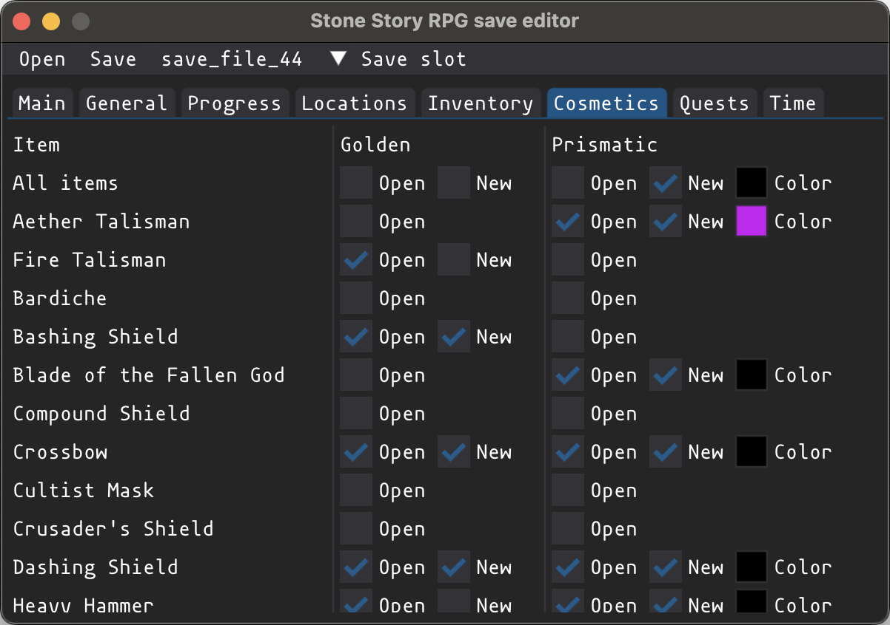

# SSRPGS
Save editor for [Stone Story RPG](https://stonestoryrpg.com). Editor can decipher save files and convert them to JSON format. Research was done with DnSPY. GUI editor written on DearPyGui.

### Installation
```bash
pip3 install -r requirements.txt
```

### Images
|  |  |
|-|-|

### Features
With editor you can do:
- Player
    - Change name, xp and level
    - Affect on maximum chests limit 
- Resources
    - Edit all types
- Progress
    - Open and close locations
    - Open and close shops
    - Open and close legend quests
    - Open and close progress tasks
- Locations
    - Set location best and average time and other values for offline farms
    - Up location star level
- Inventory
    - Create and remove items
    - Change item data, enchantments, count
    - Create and remove tags, signatures, shiny
    <!-- - Mark all items as interacted -->
- Cosmetics
    - Edit all golden skins
    - Edit all prismatic skins
    - Edit default colors of skin
- Quests
    - Mark daily quests as completed
    - Mark weekly quest as completed
    - Update timeouts for legend quests
    - Unlock premium awards for evnets
    - Done event progress and tasks
- Time
    - Restock haunted game minigame
    - Skip offline farm
    - Fix cheaters negative chest count
- Export save file as editable JSON
    - Configure any data of save file by hands
